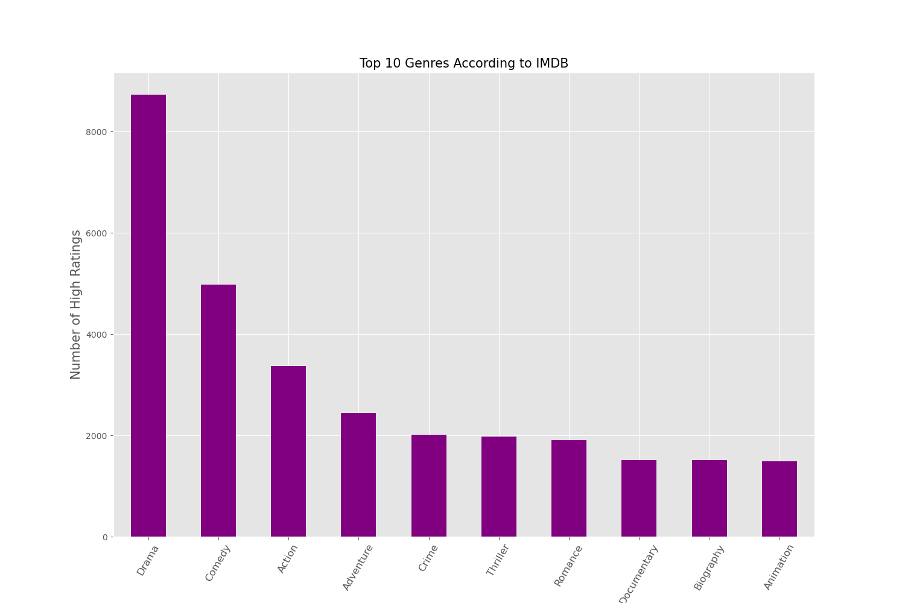
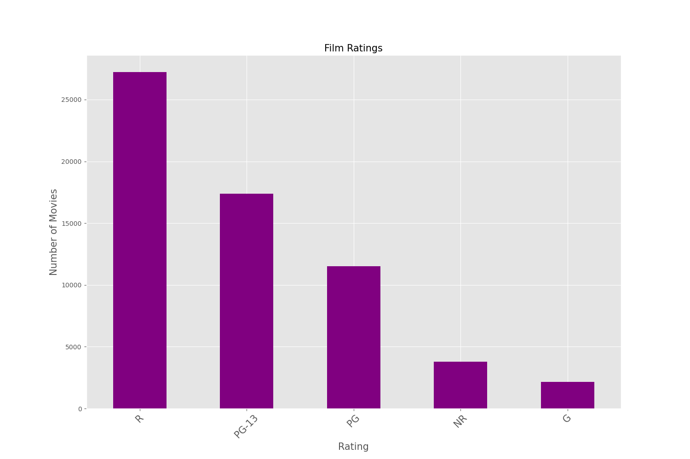
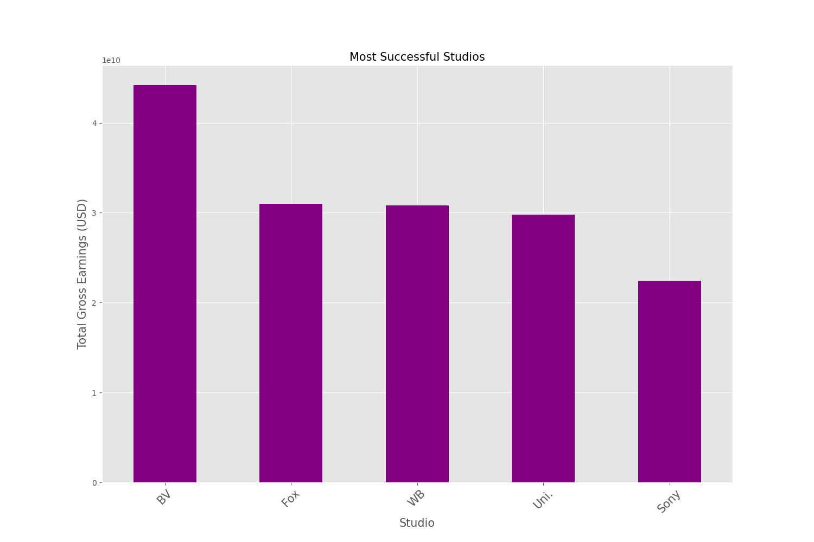

# Microsoft-Movie-Studio-Exploration-And-Data-Analysis

###### To get to view the non-technical slides just click the link below:
https://www.canva.com/design/DAF2kccMX3I/-4vOQj2a3Wmzd5BVHzSoTg/edit?utm_content=DAF2kccMX3I&utm_campaign=designshare&utm_medium=link2&utm_source=sharebutton
### a) Introduction 
Microsoft is venturing into the entertainment industry by establishing a new movie studio to create original video content. The company recognizes the success of big players in the industry and aims to capitalize on this trend. However, lacking experience in movie production, Microsoft needs insights into the current landscape of successful films at the box office. The goal is to inform strategic decisions regarding the types of films that will resonate well with audiences and maximize profitability.

### b) Problem Statement
Microsoft wants to succeed in the entertainment sector by navigating the complexities of the movie studio business by launching a new venture that will produce original video content that will appeal to viewers and yield maximum profit. Microsoft understands the necessity to learn about the present world of box office-performing films, as it has no past expertise in film creation. The strategic decisions the studio needs to make about the kinds of movies it should make to attract viewers and survive in the cutthroat industry depend heavily on this information.

### c) Main Objective
To empower Microsoft's new movie studio with actionable insights into the dynamics of the film industry, particularly focusing on box office performance by leveraging data analysis and exploration techniques using pandas, where the goal is to identify the key factors contributing to the success of movies, including genres, talented writers, directors, and popularity metrics.
### d) Specific Objectives

1. To explore Box Office Performance by analysing historical data on movies, focusing on key metrics such as total gross, average rating, and number of votes to understand box office performance.

2. Translate insights into recommendations by Providing actionable recommendations for Microsoft's movie studio, suggesting specific genres, writers, directors, and popularity metrics to consider for future movie productions.

3. Position for success by strategically positioning the new movie studio to create content that not only achieves financial success but also resonates with a diverse audience, fostering long-term growth and success in the entertainment market. 

### e) Notebook Structure
1. Data Collection
2. Read and check the data
3. Cleaning the data
4. Exploratory Data Analysis
5. Conclusions and Recommendations

### f) Data Understanding 
The data used in this project are data collected from:
1. https://www.boxofficemojo.com/
2. https://www.imdb.com/
3. https://www.rottentomatoes.com/
4. https://www.themoviedb.org/
5. https://www.the-numbers.com/

For this analysis, datasets 1 to 3 were used.

The imdb dataset contained 8 tables:
|No.| Table    |
|---| ---       |
|1|movie_basics|
|2|directors|
|3|known_for|
|4|movie_akas|
|5|movie_ratings|
|6|persons|
|7|principals|
|8|writers|

The internal structure is as shown below:

## Methodology
### 1. Data Collection:
   -The project commenced by obtaining datasets from reliable sources, establishing a robust groundwork for subsequent analyses. The primary focus was on procuring a thorough and precise dataset to generate valuable insights throughout the project's duration.

### 2. Read and Check the Data:
   
 -The datasets were efficiently loaded into the notebook, and an initial assessment was conducted. The project thoroughly examined the structure and formatting of the datasets by scrutinizing their initial rows. Comprehensive checks were implemented to identify any missing values, and thorough evaluations of data types were conducted to ensure coherence.
### 3. Cleaning and Understanding the Data:
   - 
The analysis utilized datasets from prominent movie review aggregation sites such as Box Office Mojo, IMDB, Rotten Tomatoes, The Movie DB, and The Numbers. These datasets provide information on movie genres and their popularity among both critics and viewers. A systematic cleaning process was then applied to enhance the quality of the datasets, addressing missing values, eliminating duplicates, and resolving inconsistencies. This transformation ensured that the dataset was polished, maintaining data integrity and reliability for subsequent analyses.

### 4. Exploratory Data Analysis (EDA):
### 4.1 Exploring Popular Genres
The investigation into the most popular genres delves into the analysis of positive reviews across various genres. By scrutinizing the frequency of positive feedback for each genre, a clearer picture of audience preferences emerges. The resulting graphical representation provides a visual narrative of these findings, as depicted below.

### 4.2 Unraveling Film Rating Trends
In pursuit of understanding prevailing film rating trends, the study scrutinizes the distribution of positive reviews among different rating categories. This examination sheds light on the types of ratings garnering the most favorable reception. The visualization below captures these insights, offering a visual narrative of the analysis.

### 4.3 Evaluating Studio Success
To evaluate studio success, the study examines the cumulative gross earnings of films, grouped by their respective production studios. This assessment provides valuable insights into the most lucrative studios in the industry. The resulting graphical representation below illustrates these findings, painting a vivid picture of studio performance.

## 5. Conclusion and Recommendations.
## 5a. Conclusion.
The comprehensive analysis conducted has unearthed valuable insights that can guide strategic decision-making for Microsoft's venture into the film industry. By meticulously examining various facets of the movie landscape, including genre popularity, international performance, and audience preferences, a nuanced understanding of the market dynamics has been achieved. The findings underscore the significance of aligning movie projects with audience tastes and preferences, as evidenced by the prominence of drama, action, and comedy genres. Furthermore, the correlation between domestic and international success emphasizes the importance of crafting globally appealing content. Additionally, the preference for R-rated movies signals an opportunity for Microsoft to tap into a lucrative segment of the market. Moreover, identifying competent studios and directors offers a blueprint for successful collaborations and productions. Overall, these insights equip Microsoft with actionable recommendations to navigate the competitive film industry landscape effectively.

## 5b. Recommendations
Based on the analysis, the following recommendations are proposed for Microsoft:

1. **Genre Focus**: Prioritize genres like Drama, Comedy, and Action, which resonate well with audiences, for potential movie projects.
2. **Benchmarking Studios**: Consider benchmarking against leading studios like Walt Disney Studios, Fox, and Warner Bros, known for their high-grossing worldwide releases.
3. **Embrace R Ratings**: Embrace the popularity of R-rated films, as they exhibit significant appeal among audiences.
4. **Director Selection**: For popular genres, consider collaborating with renowned directors:
   - *Drama*: Clint Eastwood & Steven Soderbergh
   - *Comedy*: Noah Baumbach & Woody Allen
   - *Action*: David Ayer & Zack Snyder

## 7. Repository Guide
- Access the datasets used [here](zippedData).
- Explore images from the exploratory analysis [here](Images).
- View the project notebook [here](student.ipynb).
- Review the presentation slides [here](presentation.pdf).
